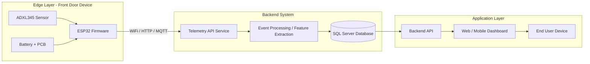

```mermaid
flowchart LR

%% ===== Edge =====
subgraph Edge[Edge Layer - Front Door Device]
    A[ADXL345 Sensor]
    B[ESP32 Firmware]
    C[Battery + PCB]
end

A --> B
C --> B

%% ===== Backend =====
subgraph Backend[Backend System]
    D[Telemetry API Service]
    E[(SQL Server Database)]
    F[Event Processing / Feature Extraction]
end

B -->|WiFi / HTTP / MQTT| D
D --> F
F --> E

%% ===== App Layer =====
subgraph App[Application Layer]
    G[Backend API]
    H[Web / Mobile Dashboard]
    I[End User Device]
end

E --> G
G --> H
H --> I
```